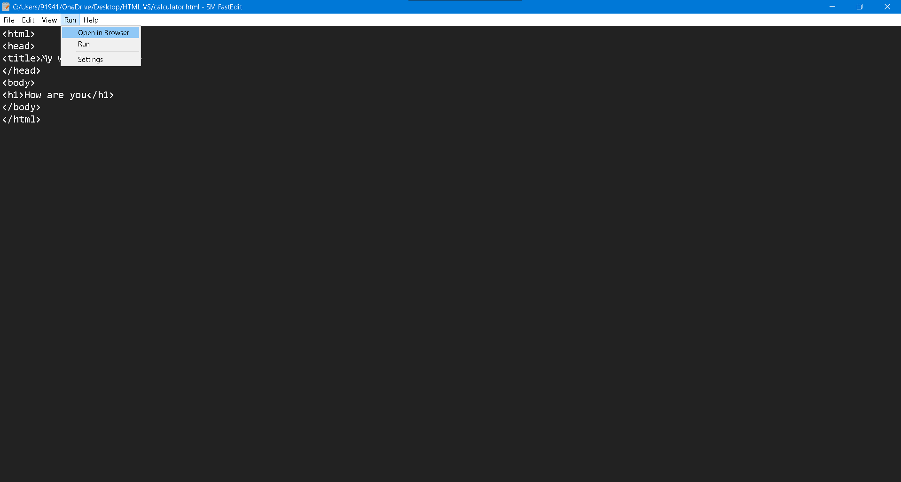

<h1> SM FastEdit </h1>
        
 FastEdit is a open source texteditor created and maintained by SM Technology. It is best for JS and PYTHON programmers. Dark mode of editor makes it perfect environment for coding.

        
        <h2><u>Features that make editor perfect are:</u></h2>
        <ul>
            <li>Read only mode.</li>
            <li>Full screen mode.</li>
            <li>Undo and Redo feature.</li>
            <li>Easy shortcuts and tips.</li>
            <li>File path in title bar.</li>
            <li>Printing supported.</li>
            <li>Multi Window mode to edit more than one file.</li>
            <li>Open in browser feature to open certain file in web browser or in default editor.</li>
            <li>Dark background for eye protection.</li>
        </ul>
        <h2><u>Keyboard Shortcuts</u></h2>
        FastEdit provides easy keyboard shortcuts to save time from clicking any menuitem.
        
Here is the list of all keyboard shortcuts

        <ul>
            <li><b>Ctrl+N</b> to create a new file.</li>
            <li><b>Ctrl+O</b> to open a existing file from directory.</li>
            <li><b>Ctrl+Shift+N</b> to create a new window.</li>
            <li><b>Ctrl+S</b> to save current file.</li>
            <li><b>Ctrl+Shift+S</b> to save file in a specific folder.</li>
            <li><b>Ctrl+Shift+P</b> to print current file.</li>
            <li><b>Ctrl+U</b> to undo last action.</li>
            <li><b>Ctrl+Y</b> to redo last action.</li>
            <li><b>Ctrl+X</b> for cut action</li>
            <li><b>Ctrl+C</b> for copy action.</li>
            <li><b>Ctrl+P</b> for paste action.</li>
            <li><b>Ctrl+A</b> to select all text.</li>
            <li><b>Ctrl+F</b> to find any text in editor.</li>
            <li><b>Ctrl+Shift+R</b> to make editor readonly.</li>
            <li><b>Ctrl+?</b> for help.</li>
        </ul>
        
For more help go to <a href="https://github.com/codeguru-eng/FastEdit/">https://github.com/codeguru-eng/FastEdit/</a>.

        

        

        <h2><u>Source code</u></h2>
        
FastEdit is a open source and free texteditor. SM FastEdit is written in python language and used HTML for minor components of application.

        <ul>    
            <li><b>Author:</b> Shaurya Mishra</li>
            <li><b>Written in:</b> Python, HTML, CSS</li>
            <li><b>Programmer:</b> Shaurya Mishra</li>
            <li><b>Application type:</b> Text editor</li>
        </ul>
        
 Source code is available in github website. Click <a href="https://github.com/codeguru-eng/FastEdit/">here</a> to go there.

        <h2> Note</h2>
        
Some features will not work because currently it is under development. But don't worry because important features will work.

        <button class="button" type="submit">Post comment (button)</button>
